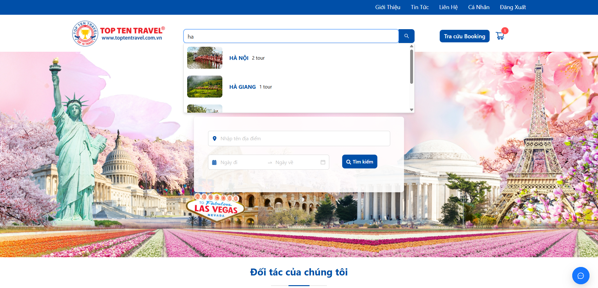
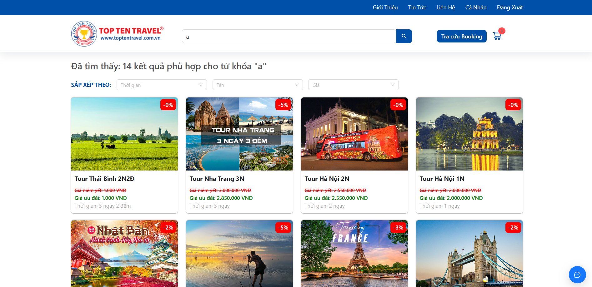
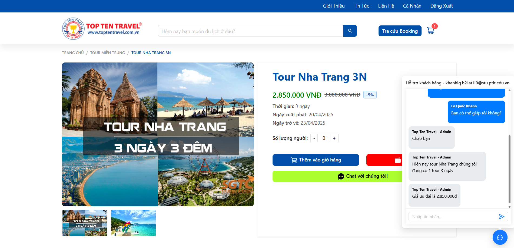
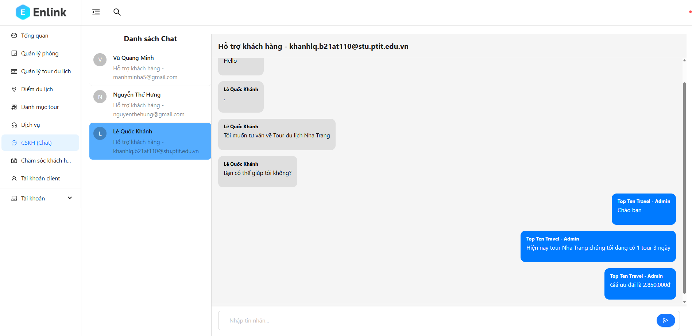
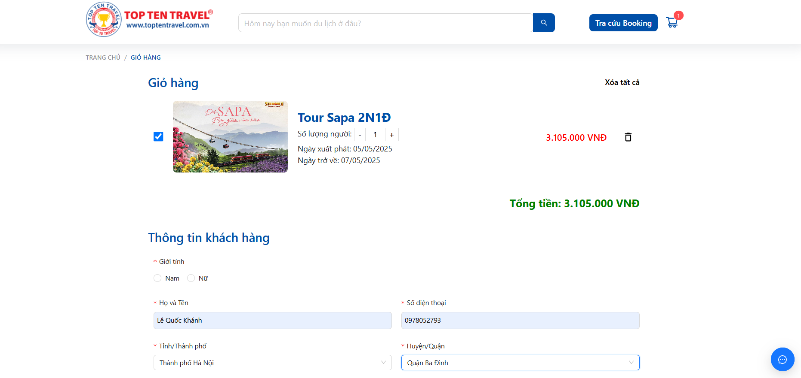
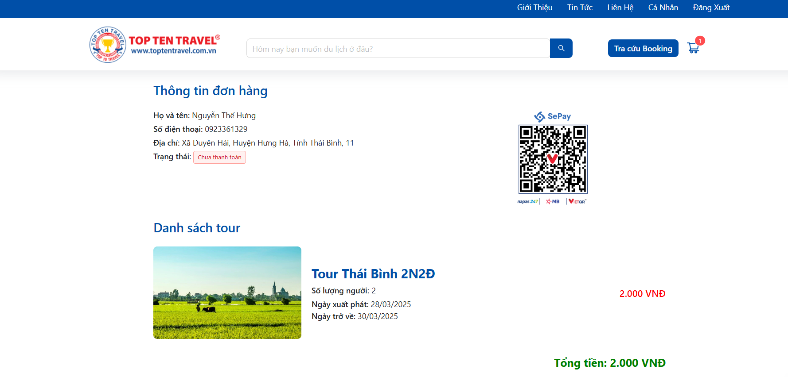
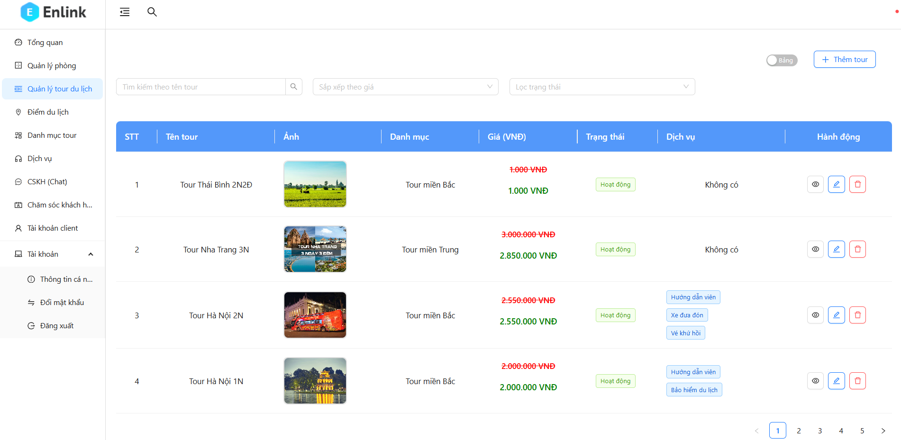

# Tour Booking website

### Home page



### Search page



### Detail page with chat



### Admin chat interface



### Cart page



### Order page



### Admin manage interface



## Overview

Tour Booking Website is a full-stack web application that allows users to browse, book tours, and make online payments seamlessly. The platform provides a user-friendly experience with real-time availability updates and an integrated chat system for customer support. Admins can manage tours, bookings, and user interactions efficiently through a dedicated dashboard.

## Technologies

- **Frontend**: ReactJS, Ant Design, SCSS, Bootstrap
- **Backend**: ExpressJS, Socket.IO
- **Database**: MongoDB
- **Cloud Storage**: Cloudinary
- **Authentication**: JWT (JSON Web Token)
- **Payment Integration**: SEPay
- **Real-time Communication**: Socket.IO
- **API Communication**: RESTful API between frontend and backend

## Features

### User Features

- **Tour Browsing & Searching**: View available tours, filter by price, location, and category.
- **Tour Booking**: Users can book tours online with real-time availability updates.
- **Online Payment**: Secure payment via SEPay gateway.
- **Live Chat Support**: Integrated chat system allows users to communicate with admins before booking.
- **Order Management**: View booking history and payment status.

### Admin Features

- **Dashboard & Management**: Intuitive admin panel to manage tours, bookings, and users.
- **Chat System**: Real-time communication with customers for better support.
- **Activity Logging**: Track all booking transactions and modifications.
- **User & Role Management**: Admins can manage user roles and permissions.

## Setup and Installation

### Prerequisites

- Node.js (v16+)
- MongoDB
- Cloudinary account for image storage
- SEPay account for payment integration

### Installation

#### Backend Setup

```bash
# Clone the backend repository
git clone https://github.com/khanh-ptit/tour-management-backend.git
cd tour-management-backend

# Install dependencies
npm install

# Create an .env file and configure environment variables
cp .env.example .env

# Start the backend server
npm run dev
```

#### Frontend Setup

```bash
# Clone the frontend repository
git clone https://github.com/khanh-ptit/tour-management-frontend.git
cd tour-management-frontend

# Install dependencies
npm install

# Start the frontend application
npm start
```

## Live Demo

[Tour Booking Website](https://tour-management-frontend-khaki.vercel.app)

## API Documentation

Once the backend server is running, access API documentation at:

```
http://localhost:5000/api-docs
```
